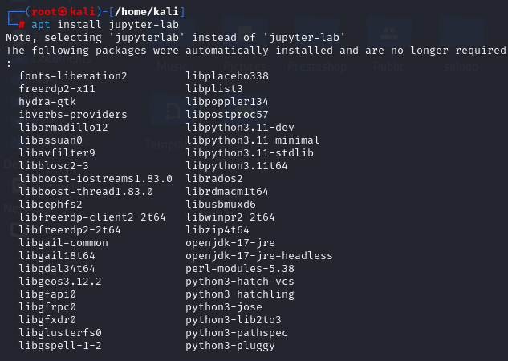

# PPS-Unidad1Actividad2-JulioManuelTatoPulido
En esta actividad trabajaremos con un lenguaje de programación llamado Python y con Jupyter notebook.

Repartido en 3 puntos:

> [Instalar Jupiter](#Instalacion-Jupyter)

> [Aprender a utilizar Jupyter](#Uso-Jupyter)

> [Conocer los elementos y sentencias de Python](#Python) 
---
## Instalacion Jupyter

1. Primero necesitamos imstalar, si no las tenemos, el paquete de python en su versión 3 y ``pip`` que es un gestor de paquetes escritos en python.
~~~
sudo apt install python3
sudo apt install pip
~~~

2. Instalamos Jupyter

~~~
apt install jupiter
~~~

  

 
Si no lo has visto, visualiza [este vídeo sobre Jupyter notebook](https://youtu.be/6Vr9ZUntCyE) 

## Uso-Jupyter

YOOOOOOOO

> __Crea algún notobook para familiarizarte con el entorno.__
> __Añade en él algún campo tanto de código como de MarkDown__

## Python

Instala Jupyter en tu equipo.

Para aprender python puedes seguir cualquiera de los dos enlaces siguientes o puedes buscar alguno que te parezca mejor

>[https://docs.python.org/3.10/contents.html](https://docs.python.org/3.10/contents.html)

>[https://uniwebsidad.com/libros/python/capitulo-2/elementos-del-lenguaje](https://uniwebsidad.com/libros/python/capitulo-2/elementos-del-lenguaje)

>[https://protegermipc.net/2019/05/22/libro-python-basico-para-hackers-y-pentester](https://protegermipc.net/2019/05/22/libro-python-basico-para-hackers-y-pentester)

En el siguiente enlace tienes el Cheatsheet sobre markdown para que lo utilices al documentar tu notebook de Jupyter: [https://www.markdownguide.org/cheat-sheet/](https://www.markdownguide.org/cheat-sheet/). Recuerda que también tienes para ello una sección en el menú de ayuda de Jupyter.

>Crea un notebook en Jupyter documentado la creación de un módulo en python que nos defina funciones a la que pasamos dos números enteros y nos devuelve el resultado. Las funciones tendrán los siguientes nombres y calcularán:
> * suma: Suma de dos números.
> * resta; Resta de dos números
> * multiplicacion: Multiplicación de dos números.
> * division: División de dos números.
> * isNumber: Indica si el argumento introducido es un número o no.
> * mayorCero: indica si el número pasado es mayor que cero.

Una vez creadas las funciones:

> Crea en el mismo ``notebook`` programa en Python con nombre mi_modulo.py que nos pida dos números y nos muestre un menú solicitándonos el tipo de operación que queremos realizar: entre suma, resta, multiplicación y división, realice la operación y muestre los resultados. El programa deberá llamar a las funciones que hemos realizado anteriormente.

---
## ENTREGA

>__Descarga el notebook realizado como "notebook de Jupyter" y lo envías a través de la plataforma.__